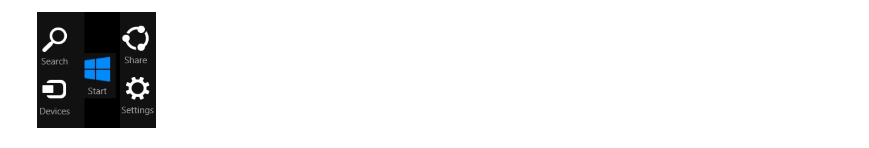
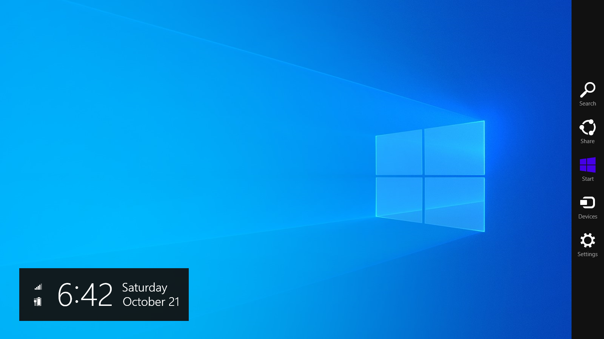

⚠️ <b>IMPORTANT NOTICE !!</b> 
The machine that was used to make this project has been fixed up around April 2025 and development should hopefully resume sometime in June 2025 or maybe even later (the shop is asking for a $200 price range) when the machine is paid and sent back. The requested features and code taken from Charms Bar Reloaded will be inserted soon.

Thank you for your extended patience. May Windows 8 and Windows 8.1 live in your hearts and memory.

<blockquote>
"Your most unhappy customers are your greatest source of learning." — Bill Gates
</blockquote>

## Contents
- [About](#about)
- [Why was this created?](#why-was-this-created)
- [How does it work?](#how-does-it-work)
- [Requirements](#requirements)
- [Features](#features)
- [Supported languages](#supported-languages)
- [Screenshots](#screenshots)
- [Q&As](#qas)
- [Disclamer](#disclaimer)
- [Support](#support)
  
## About
<b>Charms Bar Port</b> will help you bring back the Windows 8.x Charms Bar to Windows 10 and Windows 11, using real files from Windows 8.x to enhance your Windows environment and relive the Windows 8.x days. As the name suggests, it's a 1:1 conversion of the infamous Charms Bar with new features and hotfixes from the original.

Forked and completely edited from <a href="https://github.com/Jerhynh/CharmsBarRevived">CharmsBarRevived</a>, <b>Charms Bar Port</b> will assist on helping any Charms Bar fan make the jump from Windows 8.1 to Windows 10 or Windows 11, without having to stay on the obsolete operating system forever...

## Why was this created?
As you may already know, Microsoft made the annoucement to completely kill off the Charms Bar in Windows 10 in December 17, 2014. There used to be ways to restore it in the old days using ValiiNet Charms, PopCharms, RocketDock, etc.

ValiNet Charms as of 2025 is no longer available to download, PopCharms was only meant to be used between Windows 10 build 9780 and Windows 10 build 9913, and RocketDock is <b>very</b> outdated, so I created this project primarily to bring my needs of a Charms Bar back.

## How does it work?
On touch screens, swipe from the right edge towards to bring up the Charms Bar. If you're a mouse user, swipe to the top right corner and drag your cursor down to open the Charms Bar. You can also use the keyboard shortcut Windows key + C, just like it was on Windows 8.x. Included in the Charms Bar are:
 
 
<b>Search:</b> Opens the search bar from the taskbar on Win32 programs (easily remappable to function as <a href="https://github.com/srwi/EverythingToolbar">EverythingToolbar</a>, perhaps maybe even more programs that support hotkeys), or on supported Metro apps, brings their Search charm. 
<b>Share:</b> Opens the share charm. 
<b>Start:</b> Opens the start menu/screen. If you are using <a href="https://github.com/Open-Shell/Open-Shell-Menu">Open-Shell</a>, you can remap this button to open up their start menu instead or to completely disable its functionality. 
<b>Devices:</b> Opens the Connect charm. On supported Metro apps, they will open the print dialog. 
<b>Settings:</b> Opens the Settings Metro app on Win32 programs or the Settings charm on supported Metro apps.

## Requirements
* Windows 10 or Windows 11
* <a href="https://dotnet.microsoft.com/en-us/download/dotnet/7.0">.NET 7.0</a>

## Features
* Powered by Visual Studio 2022
* Based on Windows 8.1 Update 3
* Formatting-aware (uses the OS' time and date formats. If you are using 24-hour and/or date formats like "MM/DD/YYYY", Charms Bar Port will use that format. Custom formats not supported yet)
* Language-aware (automatically switches depending on your OS language)
* Uses accent colors from your system
* Network and battery status icons included
* Supports Windows 8.x-era registry keys
* Supports high contrast and light/dark mode preferences
* Fully animated to emulate Windows 8.x (can be disabled in the OS settings)
* Multi-monitor support (please read <a href="https://raw.githubusercontent.com/Icepenguins101/charms-bar-port/main/resource/helpwanted.txt">this</a>)
* Touch-friendly
* Customizable panels (can be removed through the Registry Editor)
* Fully designable: includes a Windows 7 Metro concept, Windows 8 Developer Preview, Windows 8.1 Update 3, Windows 11 Metro concept and Windows 11 Fluent concept styles by default, or you can define your custom theme instead.
* Pin anything to the Charms Bar for easy access
* Switch between Win32 and Metro modes for the currently-focused program

## Supported languages
* English
* German (Deutsch) (will be added in the next major update)
* Japanese (日本語) (will be added in the next major update)
* Russian (русский) (will be added in the next major update)
* Portuguese (Português) (will be added in the next major update)
* Italian (Italiano) (will be added in the next major update)

## Screenshots

## Download
Downloads are coming soon in the near future

## Q&As
Q: Are forked repositories the complete edition of Charms Bar Port? 
A: No. They are DEVELOPER builds, as the developer builds are not meant to be used as final products. Charms Bar Port's official release may take some time when I fix every problem associated with it.
 
 
Q: How can I disable the Charms Bar hot corners without closing the program? 
A: This requires fiddling with the registry. I am not responsible if you mess up your system.
 
1. Press the “WIN+R” key combination to launch the Run dialog box, then type regedit and press enter. It’ll open the Registry Editor, and go to following key: HKEY_CURRENT_USER\Software\Microsoft\Windows\CurrentVersion\ImmersiveShell\
2. Under the ImmersiveShell key, create a new key called EdgeUI.
3. Now select the newly created key “EdgeUI” and in the right-side pane, create two new DWORDs named <b>DisableTRCorner</b> and <b>DisableBRCorner</b> and set their values to 1. Alternatively, select the newly created key “EdgeUI” and in the right-side pane, create a new DWORD named <b>DisableCharmsHint</b> and set the value to 1.
4. That’s it. It’ll immediately disable the Charms Bar hot corners. You do not need to log off or restart the system. If you want to revert the change, set the values of <b>DisableTRCorner</b> and <b>DisableBRCorner</b> or <b>DisableCharmsHint</b>, to 0 or delete the <b>DisableTRCorner</b> and <b>DisableBRCorner</b>, or <b>DisableCharmsHint</b> DWORDs.
 
Q: When will this be released? 
A: Be patient. Charms Bar Port will be released as soon as possible when I have all the time to finalize everything and fix some critical bugs.
 
 
Q: I'm using a touch screen, why does the Action Center always open with the charms bar? 
A: This is because the action center uses the same gesture. Disable it first to start using the charms bar on your tablet/touch-enabled PC.
 
 
Q: How can I switch to the Windows 10 Technical Preview style on Charms Bar Port? 
A: For a true Windows 10 Technical Preview style, you must stay on the Windows 8.1 Charms Bar theme and requires fiddling with the registry. I am not responsible if you mess up your system. 
 
<ol>
  <li>Press the “WIN+R” key combination to launch the Run dialog box, then type regedit and press enter. It’ll open the Registry Editor, and go to following key: 
HKEY_CURRENT_USER\Software\Microsoft\Windows\CurrentVersion\ImmersiveShell\</li>
  <li>Under the ImmersiveShell key, create a new key called EdgeUI.</li>
  <li>Now select the newly created key “EdgeUI” and in the right-side pane, create a new DWORD named <b>DisableSettingsCharm</b> and set the value to 1.</li>
  <li>That’s it. It’ll remove the Settings panel from the Charms Bar, emulating the style of Windows 10 Technical Preview. You do not need to log off or restart the system. If you want to revert the change, set the value to 0 or delete the <b>DisableSettingsCharm</b> DWORD.</li>
  </ol>
 
Q: Win+C is taken, can you use another hotkey? 
A: No, this is to make the experience more authentic. Close the program that is using Win+C and Charms Bar Port will use that hotkey.
 
 
Q: Is this safe to use? 
A: Yes, it should be. Any antivirus programs complaining should be registered as a false positive.
 
 
Q: Why are the animations stiff? 
A: I'm new to C#, so the animations may not match.
 
 
Q: Why does this program not support Windows 7 and Windows 8.1? 
A: For Windows 7 users, Charms Bar Port is meant to be used on Windows 10 and Windows 11. If you want a Charms Bar for Windows 7 look elsewhere. And for Windows 8.1 users, the Charms Bar is already on your system. There's no need to create another one.
 
 
Q: How does multi-monitor support work? 
A: If you have two or more monitors, moving your mouse to the next monitor(s) will increase the activeScreen parameter (activeScreen = 0 is monitor 1, activeScreen = 1 is monitor 2, vice versa), forcing the Charms Bar to be moved over to the next screen. If it's activated by mouse but not completely "spread-out", moving to the next monitor will force the Charms Bar to deactivate, to fix a bug that the original version had (if you activated it on monitor 1 and moved your cursor to monitor 2 it will stay on the screen).
 
 
Q: I'm trying to ALT+F4 the program but it won't let me. Why? 
A: This was meant to fix a crash bug. Use Task Manager if you want to stop the program.
 
 
Q: Why is it lagging on my machine? 
A: The network icon in the Charms Clock uses the command prompt to receive network information. I'm still trying to improve performance of the program.
 
 
Q: Why is it flickering on my machine? 
A: This is a hardware specific problem. I'm planning to outsource this program to another developer to see if they can fix this better than I can. If you want to assist, please <a href="mailto:jaydenwmontoya@icloud.com">email me</a>.
 
 
Q: Can I fork this repository to release your work now? 
A: No. You can only fork it to make changes and released developer builds are not to be used for local purposes. There will be bugs on your repository and isn't stable for personal use yet.
 
 
Q: Will you do more ports from Windows 8.1? 
A: I really would love to make more ports from Windows 8.1 as I'm considering to make an App Switcher and Start Screen ports, but I would really need assistance for the start screen port to replace the default Windows start menu (or screen, if you're in 10 with the "fullscreen Start" option switched on).
 
 
Q: Will there be a version for Mac OS X and Linux? 
A: <b>No.</b> Microsoft owns full ownership of the charms bar and it would be infringement to create Charms Bar Port on those systems.
 
 
Q: How can I contact you? 
A: You can <a href="mailto:jaydenwmontoya@icloud.com">email me</a> for any assistance regarding Charms Bar Port and other products I have created.

## Disclaimer
I'm not officially affiliated with Microsoft; I moved to Mac OS X in March 3rd of 2017 for better stability and UI, and have temporarily returned to Windows 10 for better performance using web development with the announcement of macOS Sonoma. I will still be using Mac OS X as a daily driver, so there may not be enough focus given to Charms Bar Port.

## Support
Are you a fan of the Charms Bar Port program and want to help out? here are some options...

#### Programmer
Code contributions are welcome. If you are able to port Windows 8.1 features better than I can, or if you want to improve some features (especially multi-monitor support), please <a href="mailto:jaydenwmontoya@icloud.com">email me</a>.

#### Localization
Help translate Charms Bar Port to more languages. If there's a language that isn't present in Charms Bar Port please <a href="mailto:jaydenwmontoya@icloud.com">email me</a>.

#### Suggestions & Bug Report
Suggest new features or file bug reports to improve Charms Bar Port, [learn more...](https://github.com/Icepenguins101/charms-bar-port/issues)

#### Spread the word
Star this repository, leave a review of the program anywhere on your website or share it to others that want the Windows 8.x experience back!
