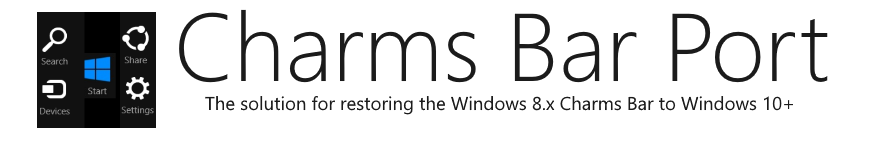
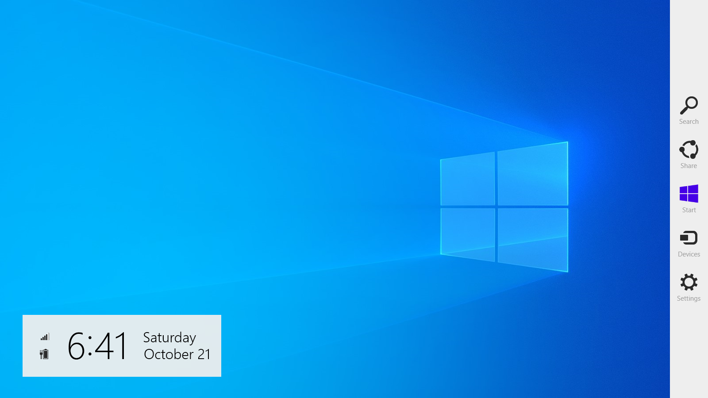

<blockquote>
"Your most unhappy customers are your greatest source of learning." -Bill Gates
</blockquote>

## About
<b>Charms Bar Port</b> is the brand new solution for bringing back the Windows 8.x Charms bar to Windows 10 and Windows 11, using real files from Windows 8.x to meet your cravings and enhance your desktop.

Forked and completely edited from <a href="https://github.com/Jerhynh/CharmsBarRevived">CharmsBarRevived</a>, <b>Charms Bar Port</b> will assist on helping you transition to Windows 10 and 11 without having to keep on the obsolete system forever.

Are you a Charms Bar fan and tired of not having it in Windows 10/11? This is your solution... 

## Why was this created?
As you may know, Windows 10 completely removed the Charms Bar upon release. There used to be vague ways to restore it in the old days using ValiiNet Charms, PopCharms, RocketDock, etc.

ValiNet Charms as of 2023 is no longer available to download, PopCharms was only meant to be used between Windows 10 build 9780 and Windows 10 build 9926, and RocketDock is <b>very</b> outdated, so I created this project primarily to bring my needs of a Charms Bar back.

## How does it work?
On touch screens, swipe from the right edge towards to bring up the Charms bar. If you're a mouse user, swipe to the top right corner and drag your cursor down to open the Charms bar. You can also use the keyboard shortcut Windows key + C, just like it was on Windows 8.x.

## Features
* Powered by Visual Studio 2022
* Based on Windows 8.1 Update 3
* Includes accent colors
* Network/battery status included
* Supports Windows 8.x-era registry hacks
* High contrast support
* Includes animation support
* Multi-monitor support <!--(<b>Can only support up to 10 monitors!</b>)-->
* Touch-friendly
* Uses WinRT resources

## Screenshots

## Download
Downloads are coming soon in the near future

## Q&As
Q: Are forked repositories the complete edition of Charms Bar Port? 
A: No. They are DEVELOPER builds, as the developer builds are not meant to be used as final products.
 
 
Q: When will this be released? 
A: Be patient. Charms Bar Port will be released as soon as possible when I have all the time to finalize everything and fix some critical bugs.
 
 
Q: I'm using a touch screen, why does the Action Center always open with the charms bar? 
A: This is because the action center uses the same gesture. Disable it first to start using the charms bar on your tablet/touch-enabled PC.
 
 
Q: How can I disable the Charms Bar hot corners without closing the program? 
A: This requires fiddling with the registry. I am not responsible if you mess up your system.
 
1. Press the “WIN+R” key combination to launch the Run dialog box, then type regedit and press enter. It’ll open the Registry Editor, and go to following key: 
HKEY_CURRENT_USER\Software\Microsoft\Windows\CurrentVersion\ImmersiveShell\
2. Under the ImmersiveShell key, create a new key called EdgeUI.
3. Now select the newly created key “EdgeUI” and in the right-side pane, create two new DWORDs named DisableTRCorner and DisableBRCorner and set their values to 1.
4. That’s it. It’ll immediately disable the Charms Bar hot corners. You do not need to log off or restart the system.
 
Q: Win+C is taken, can you use another hotkey? 
A: No, this is to make the experience more authentic. Close the program that is using Win+C and Charms Bar Port will use that hotkey.
 
 
Q: Is this safe to use? 
A: Yes, it should be. Any antivirus programs complaining should be registered as a false positive.
 
 
Q: Why are the animations stiff? 
A: I'm new to C#, so the animations may not match.
 
 
Q: Why does this program not support Windows 7 and Windows 8.1? 
A: For Windows 7 users, Charms Bar Port is meant to be used on Windows 10 and Windows 11. If you want a Charms Bar for Windows 7 look elsewhere. And for Windows 8.1 users, the Charms Bar is already on your system. There's no need to create another one.
 
 
Q: How does multi-monitor support work? 
A: If you have two or more monitors, moving your mouse to the next monitor(s) will increase the activeScreen parameter (activeScreen = 0 is monitor 1, activeScreen = 1 is monitor 2, vice versa), forcing the Charms Bar to be moved over to the next screen. If it's activated by mouse but not completely "spread-out", moving to the next monitor will force the Charms Bar to deactivate, to fix a bug that the original version had (if you activated it on monitor 1 and moved your cursor to monitor 2 it will stay on the screen).
 
 
Q: I'm trying to ALT+F4 the program but it won't let me. Why? 
A: This was meant to fix a crash bug. Use Task Manager if you want to stop the program.
 
 
Q: When I open the Start menu in Windows 10 the charms clock is not visible, why is that? 
A: This is an issue I cannot fix without embedding it into Explorer itself or signing a certificate.
 
 
Q: I have found a bug. Can you fix it? 
A: Report the problem under <a href="https://github.com/Icepenguins101/charms-bar-port/issues">the issues category</a>.
 
 
Q: Will you do more ports from Windows 8.1? 
A: I really would love to make more ports from Windows 8.1 as I'm considering to make an App Switcher and Start Screen ports, but I would really need assistance for the start screen port to replace the default Windows start menu (or screen, if you're in 10 with the "fullscreen Start" option switched on).
 
 
Q: How can I contact you? 
A: You can <a href="mailto:jaydenwmontoya@icloud.com">email me</a> for any assistance regarding Charms Bar Port and other products I have created.

## DISCLAIMER !!
I'm not officially affiliated with Microsoft; I moved to Mac OS X a few years ago for better stability and UI, and have recently returned to Windows 10 for better performance using web development. I will still be using OS X as a daily driver.
