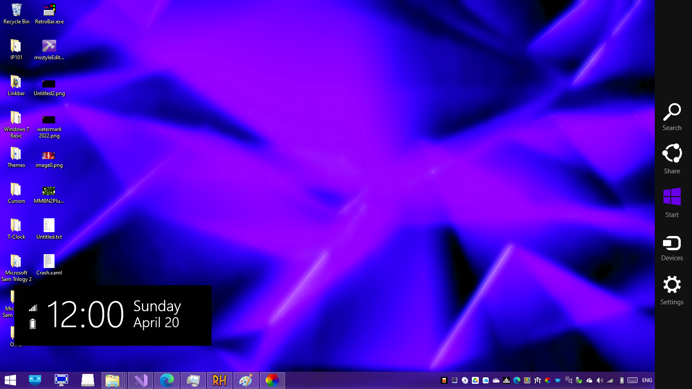

## About
<b>Charms Bar Port</b> is the brand new solution for bringing back the Windows 8.x Charms bar to Windows 10 and Windows 11, using real files from Windows 8.x to meet your cravings and enhance your desktop.

Forked and completely edited from <a href="https://github.com/Jerhynh/CharmsBarRevived">CharmsBarRevived</a>, <b>Charms Bar Port</b> will assist on helping you transition to Windows 10 and 11 without having to keep on the obsolete system forever.

## Why was this created?
As you may know, ValiNet Charms is no longer available to download and an Archive.org repository containing a newer version appears to be in Russian and is infected, so I created this project primarily to bring my needs of a Charms Bar back.

## How does it work?
On touch screens, swipe from the right edge towards to bring up the Charms bar. You can also use the keyboard shortcut Windows key + C, just like it was on Windows 8.x.

## Features
* Powered by Visual Studio 2022
* Based on Windows 8.1 Update 3
* Includes accent colors!

## Screenshots
<!--<b>These are not the final previews!</b>  -->

## Download
Downloads are coming soon in the near future

## Q&As
Q: When will this be released? 
A: I personally don't know as I'm always busy with other things. If anyone wants to have their go at porting the animations and clock layouts then ask me, and I'll send a Google Drive link for you to improve upon.
